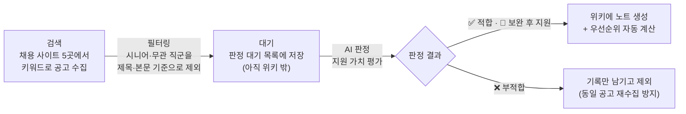
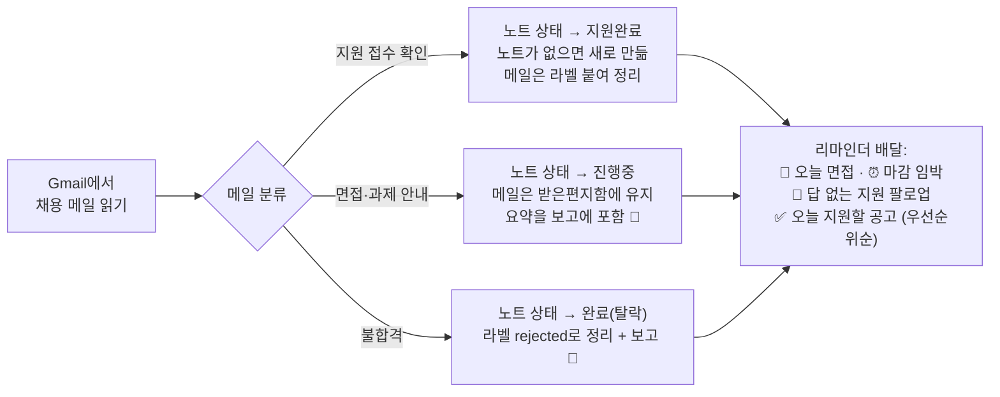

# Hermes 세컨브레인 + 구직 자동화 템플릿

[Hermes Agent](https://github.com/NousResearch/hermes-agent) 위에 얹는 설치 템플릿. 두 가지가 들어 있다:

- **세컨브레인** — Obsidian 위키를 AI의 기억 저장소로 쓰는 폴더 구조와 기록 규칙
- **구직 자동화** — 한국 채용 공고를 모으고, AI가 골라내고, 지원 이후 현황까지 관리하는 파이프라인

> 개인정보·시크릿은 전부 제거했다. 본인 것으로 채워 쓰면 된다. (0.18.x에서 개발·검증)

## ⚡ Quick Start

> **맨땅에서 시작한다면** (VPS 결제 → 봇 토큰 → Composio → 위키 동기화): 셋업은 별도 스킬 레포
> **[hermes-vps-setup](https://github.com/Wendy-Nam/hermes-vps-setup)** 이 전담한다 — `~/.agents/skills`(Codex)나
> `~/.claude/skills`(Claude Code)에 클론하고 "헤르메스 설치 도와줘"라고 하면 에이전트가 집도한다.
> GPT 구독이든 클로드 구독이든 무관, zip으로 전달해도 된다.
>
> 아래는 Hermes가 이미 돌고 있는 서버에 키트를 얹는 절차다.

```bash
git clone <repo> && cd hermes-agent-kit
pip install -r requirements.txt # 의존성(PyYAML·requests·jieba) — 빠뜨리면 스킬 추천이 조용히 죽는다
./install.sh /opt/data          # 이미 있는 파일은 덮어쓰지 않는다 (⚠️ /opt/data 권장 — 아래 참고)
python3 tests/smoke_test.py     # 코드가 제대로 도는지 점검(25축, 네트워크 불필요)
python3 bin/kit-doctor.py /opt/data   # 설치본 점검 — 병합 실수·손상 파일·의존성·크론 배달지
```

1. `config.example.yaml`을 본인 `config.yaml`에 합치고 API 키를 채운다.
2. `cron/jobs.json`에서 쓸 자동화만 골라 합친다 — **처음엔 전부 꺼져 있다.** 이해한 것부터 하나씩 켜라(켜는 순간 메시지 발송·API 비용이 생긴다).
3. Hermes 재시작.

**키트를 새 버전으로 올릴 때**: `./install.sh /opt/data --upgrade` — 키트 관리 코드(skills·scripts·bin·plugins)만 교체하고, 교체된 기존 파일은 `.backups/upgrade-*/`에 보존한다. **wiki·SOUL.md·search-profile.yaml·상태파일·크론 설정은 업그레이드에도 절대 건드리지 않는다.** (플래그 없이 재실행하면 기존처럼 빠진 파일만 보강)

막히면 [CUSTOMIZE.md](CUSTOMIZE.md)에 단계별 안내가 있다.

## 🤝 Codex·Claude Code에서도 쓰기

스킬은 오픈 Agent Skills 표준(SKILL.md)이라 Hermes 밖에서도 그대로 동작한다.
Codex는 `~/.agents/skills`, Claude Code는 `~/.claude/skills`에서 스킬을 읽는다:

```bash
# Codex CLI 기준 — Claude Code는 대상 경로만 ~/.claude/skills 로
mkdir -p ~/.agents/skills
for d in skills/*/*/; do [ -f "$d/SKILL.md" ] && ln -s "$PWD/${d%/}" ~/.agents/skills/; done
export HERMES_DATA="$PWD"   # search-profile.yaml(검색·필터 SoT)을 레포에서 읽게
```

- 구직 스크래퍼·job-match·인터뷰/코드 그릴·저널링 등은 Hermes 밖에서도 동작한다(Composio 쓰는 스킬은 그 에이전트에 Composio MCP만 연결돼 있으면 된다). Hermes 운영 전용 스킬(선톡·크론·Discord 라우팅 등)은 `description`에 `Hermes-only`로 스코프돼 있어 다른 에이전트에선 링크만 안 하면 된다.
- 심링크 설치여도 공유 모듈(`jobfilter.py`)과 설정은 원본 위치에서 올바르게 찾는다(realpath 기반).

## ⚠️ 설치 경로는 사실상 `/opt/data` 기준이다

설치기는 다른 경로도 받지만, **크론 프롬프트·SOUL·일부 운영 스크립트에는 `/opt/data`가 문자열로 박혀 있다**(LLM에게 주는 지시문이라 완전한 변수화가 어렵다). 파이프라인 코어(수집·판정·노트 도구·필터)는 `HERMES_DATA`를 따르지만, 다른 경로에 설치하면 그 문자열들을 직접 바꿔야 한다. 특별한 이유가 없으면 `/opt/data`를 쓰는 게 안전하다.

## ⚠️ 기본값은 "한 사람" 기준이다

구직 필터 기본값은 **주니어 · 한국 · 세일즈/옵스** 프로필에 맞춰져 있다. 본인에게 맞추려면 **파일 두 개만** 고치면 된다:

- `search-profile.yaml` — 무엇을 검색하고 무엇을 거를지 (키워드 · 연차 상한 · 제외 직군 · 채용 사이트)
- `wiki-template/automation/job-hunting/Rules.md` — AI가 공고를 판정하는 기준 (적합/부적합, 회사 등급)

나머지 파이프라인은 누구에게나 그대로 동작한다. 수정법은 [CUSTOMIZE.md](CUSTOMIZE.md) 참고.

## 구직 자동화 ① — 공고를 모으고 골라낸다

하루 두 번 크론이 이 순서로 돈다:



- **AI가 판정하기 전에는 위키에 아무것도 안 들어온다.** 부적합 공고가 쌓이는 걸 구조적으로 막는다.
- **같은 공고를 두 번 수집하지 않는다.** 확인한 URL을 기록해 둬서, 걸러진 공고가 재게시돼도 다시 안 들어온다.
- **우선순위 점수가 자동으로 붙는다** — 회사 등급(S~D) + 선호 직군 + 적합도의 합산.

## 구직 자동화 ② — 지원한 다음을 챙긴다

매일 크론이 Gmail의 채용 메일을 읽고 공고 노트를 갱신한 뒤, 오늘 챙길 일을 알려준다:



- **회사명이 정확히 일치하는 노트가 딱 하나일 때만** 상태를 바꾼다. 애매하면 "📬 확인 필요"로 보고만 한다.
- **채용 사이트 밖에서 직접 지원한 것도** 접수 확인 메일이 오면 위키에 등록된다.
- **노트를 고칠 때는 해당 칸 하나만 바꾼다** — 노트 전체를 다시 쓰다 링크가 날아간 적이 있어 금지했다.

## 🛡️ 처음 켤 때 알아둘 것

- **크론은 전부 꺼진 상태**로 배포된다. 하나씩 이해하고 켜라.
- **쓰기가 기본으로 꺼져 있다.** 노트·상태 파일을 바꾸는 도구는 **스위치를 켜기 전까지 코드가 쓰기를 거부한다**(AI가 뭘 잘못 실행해도 파일은 안 바뀜). 며칠 `[DRY-RUN]` 보고를 읽고 판정이 맞는지 확인한 뒤 켜라:
  ```bash
  touch /opt/data/.kit-live      # 쓰기 켜기 (재시작 불필요) · 끄려면 이 파일을 지운다
  ```
  `HERMES_KIT_LIVE=1` 환경변수도 같은 역할을 하고, 켠 뒤에도 `HERMES_KIT_DRY_RUN=1`을 주면 그 실행만 읽기 전용이 된다.
  ⚠️ Gmail 변경(읽음·라벨·휴지통)은 외부 서비스(Composio) 호출이라 이 스위치로 **막을 수 없다** — 오직 프롬프트 지시로만 통제되고 되돌릴 수도 없다. 그래서 며칠 DRY-RUN 관찰은 **권장이 아니라 필수다**. 메일 크론은 이 관찰을 끝낼 때까지 실동작으로 넘기지 말 것.
  진짜로 코드-외부 게이트를 원하면 **관찰 기간엔 Gmail을 읽기 전용 스코프로 연결**하라 — 쓰기 도구(휴지통·라벨)가 스코프 부족으로 실패하므로, 프롬프트 인젝션이나 모델 오판이 있어도 메일이 안 바뀐다. 검증이 끝난 뒤 쓰기 스코프로 다시 연결한다.
- **기존 `SOUL.md`는 덮지 않는다.** 캐릭터는 그대로 두고, 파이프라인이 필요로 하는 운영 규칙만 뒤에 붙인다(원본은 백업).
- `tests/smoke_test.py`가 필터·노트 안전성·동시성·SSRF 가드 등 25가지를 자동 점검한다(CI에서 Python 3.10·3.12 양쪽 실행, 네트워크 없이 자립).
- **자동 검사되지 않는 것**(솔직히): 실제 Hermes 0.18.x 플러그인 로딩·크론 스키마 호환·Discord 배달·Composio Gmail 변경·이미지 공고 판독은 **살아있는 Hermes가 있어야 검증되므로 CI에 없다.** `kit-doctor.py`가 설정·배달지·의존성까지는 봐주지만, 실제 연동은 **쓰기 스위치를 켜기 전 며칠간 `[DRY-RUN]` 보고를 눈으로 확인**하는 게 유일한 검증이다. 채용 사이트 HTML이 바뀌면 파서가 깨지는데, 그건 '0건'이 아니라 경고로 드러난다.
- **외부 콘텐츠는 데이터로만 취급하도록** SOUL·크론 프롬프트에 경계를 넣었다(공고·메일에 적힌 지시는 따르지 않음). 다만 이건 프롬프트 수준 방어라 100%는 아니다 — 그래서 DRY-RUN 기간이 필요하다.
- 외부 저작 플러그인(`hermes-snow-search`·`rtk-rewrite`)은 업스트림 라이선스를 확인하지 못해 **이 배포판에서 제외했다**([THIRD_PARTY_NOTICES.md](THIRD_PARTY_NOTICES.md)). 필요하면 `mirror` 브랜치에 있으니 원저작자 라이선스를 직접 확인하고 쓸 것. 배포판에 남은 플러그인(`eagle-eye`·`conditional-rules`·`turn-router`·`hermes-self`·`autonomous-triggers`·`ux-improvements`·`session-sticky`·`shared-music`·`web-crawl4ai`)은 전부 원저작이다.

## 구성

| 경로 | 설명 |
|---|---|
| `wiki-template/` | Obsidian 위키의 뼈대 — 주제별 폴더와 기록 규칙(`SCHEMA.md`). 개인 노트는 없음. |
| `skills/job-search/` | 공고 수집 스킬 — 원티드 · 사람인/잡코리아 · 링크드인 · 외국계 채용페이지(Greenhouse/Lever/Ashby). `job-match`는 공고와 이력서 궁합을 채점한다(이미지 공고문도 읽음). |
| `scripts/job-collect.py` | 공고 수집기. LLM을 안 써서 **비용이 들지 않는다.** |
| `bin/` | 관리 도구 — `note-set-field.py`(노트 속성 안전 수정), `priority-recalc.py`(우선순위 계산), `proxy-doctor.py`(죽은 프록시 감지·자동 교체), `patch-soul-import.py`(SOUL `@import` 모듈 확장, 선택), 위키 점검. |
| `plugins/` | `eagle-eye`(맥락 스킬 추천) · `conditional-rules`(SOUL 상세 규칙을 관련 턴에만 주입) · `turn-router`(스킬 검색+규칙 라우팅 단일 훅) · `hermes-self`(자아 런타임 — [상세](plugins/hermes-self/README.md)) · `autonomous-triggers`(내부 상태→자율 행동 큐잉) · `ux-improvements`(Discord 출력 정리) · `session-sticky` · `shared-music` · `web-crawl4ai`. |
| `scripts/self_runtime/` | `hermes-self`의 Node 상태 엔진 — self.db CRUD, 승격 사이클, 리플렉션. 자체 [README](scripts/self_runtime/README.md) 참고. |
| `cron/jobs.json` | 자동화 작업 목록. 전부 꺼진 상태. |
| `config.example.yaml` | 설정 예시 — 모델·플러그인·키 자리. |

## 요구사항

- 동작 중인 Hermes 에이전트 + **이미지를 읽을 수 있는 AI 모델**(이미지로 된 공고문 판독용)
- Obsidian + Syncthing(PC↔서버 동기화) — 구직 대시보드는 TaskNotes·Bases 플러그인 사용
- 채용 메일 기능을 쓰려면 Composio로 Gmail 연결

<details>
<summary>수동 설치 (install.sh 대신 손으로)</summary>

```bash
cp -r skills/*            /opt/data/skills/
cp    scripts/*           /opt/data/scripts/
cp    bin/*               /opt/data/bin/
cp -r plugins/*           /opt/data/plugins/
cp -r wiki-template/*     /opt/data/wiki/
cp    search-profile.yaml /opt/data/search-profile.yaml   # ⚠️ 빠뜨리면 수집기가 기본값으로 조용히 돈다
chown 10000:10000 <새로 복사한 것들>                       # 기존 파일 소유권은 건드리지 말 것

# SOUL — 없으면 예시본 복사:
cp SOUL.example.md /opt/data/SOUL.md
# 이미 있으면 덮지 말고 운영 규칙만 뒤에 붙인다(캐릭터는 그대로):
sed -n '/OPERATING-RULES:BEGIN/,/OPERATING-RULES:END/p' SOUL.example.md >> /opt/data/SOUL.md
```

그다음 `config.example.yaml`·`cron/jobs.json`을 본인 설정에 합치고(배달 채널 `origin.chat_id`를 본인 디스코드 채널로, `thread_id`는 `null`) Hermes를 재시작한다.
</details>

---
*구성요소별 출처·라이선스는 [THIRD_PARTY_NOTICES.md](THIRD_PARTY_NOTICES.md). 운영 설치본 전체 백업은 `mirror` 브랜치(벤더 번들 스킬이 섞여 있어 설치용 아님).*
*참고용으로 공유 — 자유롭게 고쳐 쓰세요.*
