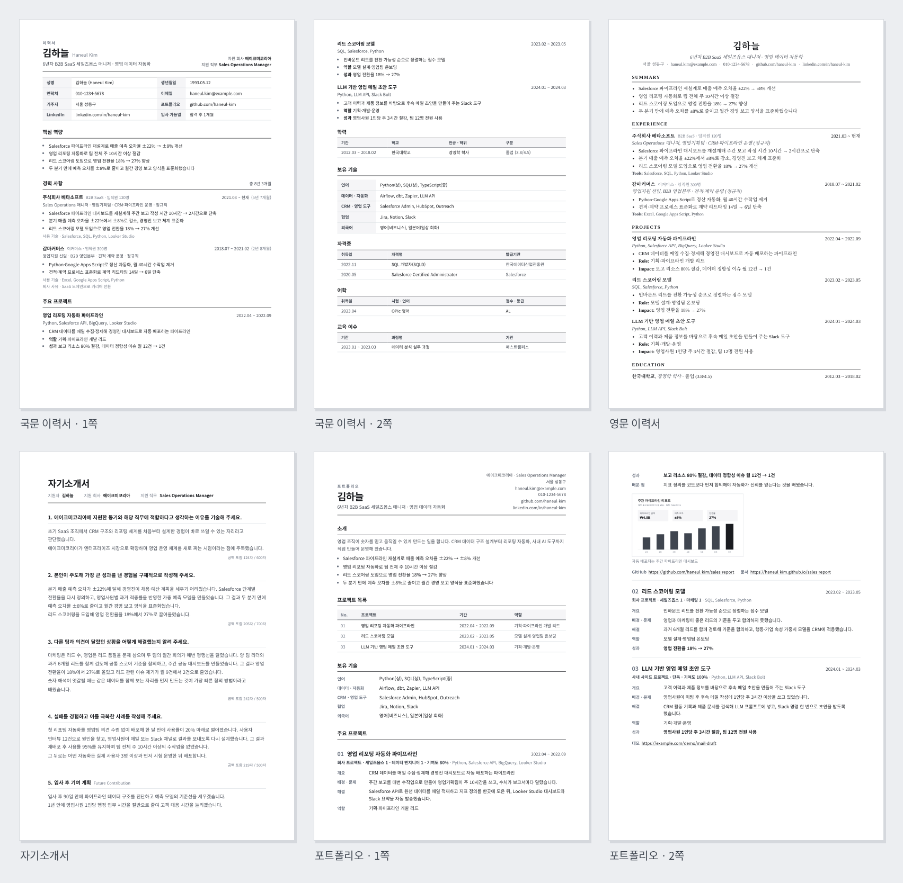

# Hermes Agent 구직 자동화 번들

Hermes Agent 위에 설치하는 **구직 전용 이식 번들**입니다. 공고 수집부터 지원 상태, 이메일 확인, 회사·면접 리서치, 맞춤 이력서·자소서까지 한 흐름으로 관리합니다.

## 빠른 설치

```bash
git clone <repo> && cd hermes-agent-kit
python3 -m pip install -r requirements.txt
./install.sh /opt/data
python3 tests/smoke_test.py
python3 /opt/data/bin/kit-doctor.py /opt/data
```

기본 경로는 `/opt/data`입니다. 설치기는 기존 파일을 덮어쓰지 않으며 `--upgrade`로 관리 코드의 교체본만 백업 후 갱신합니다.

```bash
./install.sh /opt/data --upgrade
./uninstall.sh /opt/data --dry-run
```

## 포함 기능

| 단계 | 구성요소 | 역할 |
|---|---|---|
| 검색·수집 | Wanted, KR, LinkedIn, ATS, Web | 여러 보드의 공고를 공통 JSON으로 수집 |
| 필터·판정 | `job-hunter-kit`, `job-collect.py` | 중복 제거, 프로필 필터, 적합도 판정 대기열 |
| 지원 관리 | `job-alert-mail`, `job-match` | 채용 메일 분류, 지원 노트 생성·갱신, JD 조회 |
| 문서 작성 | `generate-tailored-resume.py` | 마스터 경력·역량 근거를 JD에 맞춰 국문/영문 이력서·자소서 생성 |
| 면접 준비 | `company-interview-research`, `interview-grill`, `web-reader` | 회사 조사, 웹 참고자료 수집, 질문 연습 |
| 관리 UI | Obsidian 볼트 템플릿 | 공고·리서치·복기·이력서 자료와 TaskNotes 대시보드 |
| 자동화 | `bundle/cron/jobs.json` | 수집, 판정, 메일 확인, 리마인더 작업(기본 모두 비활성) |

## 문서 서식 예시

가상 인물 자료로 생성한 국문·영문 이력서, 자기소개서, 포트폴리오입니다. 모두 A4 인쇄용 미니멀 서식입니다.



| 문서 | HTML | PDF |
|---|---|---|
| 국문 이력서 | [resume_ko.html](docs/examples/output/resume_ko.html) | [resume_ko.pdf](docs/examples/output/resume_ko.pdf) |
| 영문 이력서 | [resume_en.html](docs/examples/output/resume_en.html) | [resume_en.pdf](docs/examples/output/resume_en.pdf) |
| 자기소개서 | [cover_letter_ko.html](docs/examples/output/cover_letter_ko.html) | [cover_letter_ko.pdf](docs/examples/output/cover_letter_ko.pdf) |
| 포트폴리오 | [portfolio_ko.html](docs/examples/output/portfolio_ko.html) | [portfolio_ko.pdf](docs/examples/output/portfolio_ko.pdf) |

입력으로 쓴 자료는 [`docs/examples/wiki/…/master_resume.md`](docs/examples/wiki/automation/job-hunting/resume/master_resume.md)와 [`portfolios.md`](docs/examples/wiki/automation/job-hunting/resume/portfolios.md)입니다. 빈 서식을 채울 때 참고하세요. 예시는 `python3 docs/examples/build_examples.py`로 다시 만들 수 있습니다(Chrome, `pymupdf`, `pillow` 필요).

## 번들 구조

```text
bundle/
├── job-search/
│   ├── bin/       공고·노트·우선도·이력서 생성 도구
│   ├── scripts/   수집기와 내부 모듈
│   └── skills/    보드·메일·리서치·문서 작성 스킬
├── config/        검색 프로필과 Hermes 설정 예시
├── cron/          비활성 크론 예시
└── vault/         Obsidian 볼트 템플릿
```

실행 파일은 기존 Hermes 호환 경로인 `/opt/data/{skills,scripts,bin,wiki}`에 설치됩니다.

## 처음 설정하는 순서

1. `/opt/data/search-profile.yaml`에서 검색어, 연차, 제외 직군과 보드를 조정합니다.
2. `/opt/data/wiki/automation/job-hunting/Rules.md`에서 공고 적합도 기준을 정합니다.
3. `/opt/data/wiki/automation/job-hunting/resume/`에 마스터 경력, 성과 근거, 직무 맥락과 포트폴리오를 채웁니다.
4. `bundle/config/config.example.yaml`과 `bundle/cron/jobs.json`의 자리표시자를 본인 값으로 바꿉니다.
5. 메일 쓰기 전에 `.kit-live`와 Gmail 권한을 제외한 DRY-RUN 기간을 먼저 운영합니다.

상세 조정 항목은 [CUSTOMIZE.md](CUSTOMIZE.md)를 보세요.

## 안전 장치

- 노트와 상태 파일 쓰기는 기본적으로 차단되며 `touch /opt/data/.kit-live`로 로컬 쓰기를 허용합니다.
- `HERMES_KIT_DRY_RUN=1`은 한 실행만 읽기 전용으로 만듭니다.
- 수집기·판정·메일 크론은 기본 비활성이며 외부 서비스 변경은 별도 권한으로 통제해야 합니다.
- 회사가 정확히 1:1로 대응할 때만 지원 상태를 갱신합니다.

## 요구사항

- Python 3.10 이상
- Hermes Agent(자동 크론과 메일 연동용)
- Obsidian의 TaskNotes·Dataview·Tasks 플러그인(대시보드용)
- 채용 메일 연동용 Gmail API 또는 Composio 연결

개인정보와 API 키는 포함되어 있지 않습니다.
